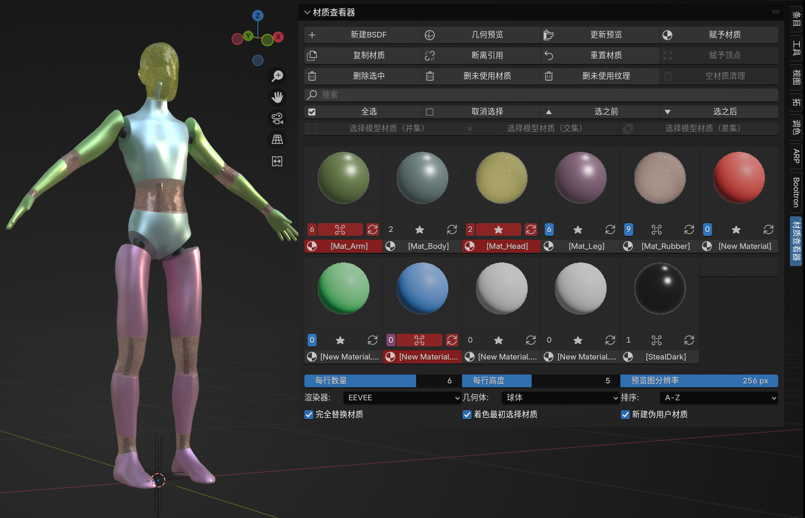

# IMS 材质查看器 (Material Inspector)

这个是我尝试使用Deepseek和Trae的agent写的一个挺好用的材质预览插件，解决了Blender没有材质管理窗口的问题。

我指的“材质管理窗口”不是已经有的“资产浏览器”，而是需要能管理当前项目所动态创建的材质的工具。

详细介绍可查看专栏：https://www.bilibili.com/opus/1230069983543820304

下面是AI写的介绍：

---

一个高效的 Blender 材质管理插件，提供直观的材质预览网格、批量操作和智能管理功能。

## 功能概览

- **材质预览网格** — 以缩略图网格展示所有材质，支持自定义每行数量、高度和预览分辨率
- **实时预览渲染** — 自动为每种材质生成预览图，支持 EEVEE 和 Cycles；批量更新时复用场景，高效无卡顿
- **灵活的选择系统** — 单击独选、Shift+点击多选、Ctrl+点击定位引用物体、Alt+点击收藏；名称栏单击选材，双击重命名
- **模型材质选择** — 根据选中模型的材质列表反向勾选，支持并集/交集/差集三种模式
- **批量材质操作** — 复制、断离、重置、删除勾选的材质，全部带确认弹窗
- **赋予材质** — 支持完全替换和追加两种模式，可选反转顺序或插入到列表最前面
- **赋予顶点** — 在编辑模式下将激活材质赋予选中的面，无需顶点组
- **几何预览** — 在游标处快速创建带有选中材质的预览几何体
- **收藏系统** — 收藏常用材质，排序时可仅显示收藏项；删除材质自动清理收藏记录
- **搜索与排序** — 按名称搜索过滤，支持 A-Z、Z-A、收藏A-Z、收藏Z-A 四种排序
- **智能重命名** — 重命名材质时自动同步预览图、收藏、勾选、激活状态
- **伪用户管理** — 每个材质卡片上直接切换伪用户标记，高亮显示状态
- **清理工具** — 一键清除未使用材质、未使用纹理、空材质槽位；清理时同步清除收藏残留
- **快捷键集成** — Del 键可直接删除勾选的材质
- **自动监听** — depsgraph 监听自动处理材质新增/删除/重命名；项目加载时自动更新已有预览的材质

## 安装

1. 下载本仓库的 ZIP 文件
2. 打开 Blender → 编辑 → 偏好设置 → 插件 → 安装
3. 选择下载的 ZIP 文件，点击"安装插件"
4. 在插件列表中搜索"IMS材质查看器"并勾选启用

> 也可以直接将 `material_inspector` 文件夹复制到 Blender 的 `addons` 目录中。

## 使用指南

插件面板位于 **3D 视图 → 侧边栏 (N) → 材质查看器**。

### 材质预览网格

材质以缩略图卡片网格的形式排列，每个卡片包含：

| 元素 | 说明 |
|------|------|
| 预览图 | 材质渲染预览缩略图，点击可激活/选择 |
| 引用计数按钮 | 显示该材质被多少个网格物体引用；高亮表示已启用伪用户，点击切换 |
| ⌘按钮 | 单击激活材质并在着色器编辑器中打开；Alt+点击收藏/取消收藏；Ctrl+点击选中所有引用该材质的物体 |
| 刷新按钮 | 单独重新渲染该材质的预览图 |
| 材质名称 | **单击**选中材质（Shift多选）；**双击**弹出重命名对话框 |

### 键盘与鼠标快捷键

| 操作 | 效果 |
|------|------|
| **单击** 预览图/⌘/名称 | 独选该材质，并在着色器编辑器中显示 |
| **Shift + 点击** | 多选 / 减选材质 |
| **Alt + 点击** ⌘ | 收藏 / 取消收藏（不改变选择状态） |
| **Ctrl + 点击** ⌘ | 选中场景中所有引用该材质的网格物体 |
| **双击** 材质名称 | 弹出重命名对话框 |
| **Del 键** | 删除所有已勾选的材质（有勾选时）；无勾选时透传为默认行为 |

### 顶部工具栏

| 按钮 | 说明 |
|------|------|
| 新建BSDF | 创建新的 Principled BSDF 材质，自动生成预览 |
| 几何预览 | 在 3D 游标处创建预览几何体并赋予勾选的材质 |
| 更新预览 | 批量为所有材质（重新）生成预览图，复用临时场景高效执行，带进度条 |
| 赋予材质 | 将勾选的材质赋予选中的网格模型 |

### 材质操作行

| 按钮 | 说明 |
|------|------|
| 复制材质 | 复制勾选的材质（自动生成唯一名称），保留伪用户和收藏状态 |
| 断离引用 | 从所有模型上移除勾选材质的引用，材质本身保留 |
| 重置材质 | 将勾选的材质还原为干净的 Principled BSDF |
| 赋予顶点 | 编辑模式下，将激活材质赋予选中的面（直接面选择，无需顶点组） |

### 选择工具行

| 按钮 | 说明 |
|------|------|
| 全选 / 取消选择 | 批量勾选或取消所有材质 |
| 选之前 / 选之后 | 以当前激活材质为基准，选中排序在它之前/之后的所有材质 |

### 模型材质选择

| 按钮 | 说明 |
|------|------|
| 选择模型材质（并集） | 勾选所有选中模型上的全部材质（去重） |
| 选择模型材质（交集） | 仅勾选所有选中模型共有的材质 |
| 选择模型材质（差集） | 仅勾选各模型独有的材质（仅在一个模型中出现） |

> 无匹配时自动清空当前选择。

### 清理工具

| 按钮 | 说明 |
|------|------|
| 删除选中 | 永久删除所有勾选的材质及其预览图 |
| 删未使用材质 | 清除无模型引用且未设伪用户的材质 |
| 删未使用纹理 | 清除未被引用的纹理图像（排除插件预览图和伪用户纹理） |
| 空材质清理 | 清除选中模型材质列表中的空槽位（常见于导入模型） |

### 配置选项

| 设置 | 说明 | 默认值 |
|------|------|--------|
| 每行数量 | 预览网格每行材质的数量 | 3 |
| 每行高度 | 预览卡片的高度缩放 | 6 |
| 预览图分辨率 | 预览图的边长（像素） | 256 |
| 渲染器 | 预览图渲染引擎（EEVEE / Cycles） | EEVEE |
| 几何体 | 预览图使用的几何体（球体/平面/立方体/圆柱体） | 球体 |
| 排序 | 材质排列顺序（A-Z / Z-A / 收藏A-Z / 收藏Z-A） | A-Z |
| 完全替换材质 | 赋予材质时替换整个材质列表（关闭则追加） | 开启 |
| 着色最初选择材质 | 赋予材质后将最初选择的材质设为可见材质（关闭则反转顺序） | 开启 |
| 新建伪用户材质 | 新建材质时自动启用伪用户 | 开启 |

### 赋予材质模式详解

| 完全替换 | 着色最初 | 行为 |
|----------|----------|------|
| ON | ON | 清空列表，按选择顺序赋予，模型显示第一个选择材质 |
| ON | OFF | 清空列表，反转顺序赋予，模型显示最后一个选择材质 |
| OFF | ON | 新材质插入到列表最前面，旧材质后移 |
| OFF | OFF | 反转顺序后追加到材质列表末尾 |

## 兼容性

- **Blender 版本**：3.0 及以上
- 自动检测当前版本的 EEVEE 渲染引擎标识符（兼容 EEVEE Legacy 和 EEVEE Next）
- 自动平滑着色兼容新旧 Blender API（`use_auto_smooth` 属性 vs `shade_smooth_by_angle` 操作符）

## 技术特性

- **场景复用渲染** — 批量更新预览时创建一次临时场景，后续仅替换材质，大幅减少 depsgraph 更新开销
- **分帧执行** — 在 modal timer 中逐个材质渲染，配合进度条反馈，不阻塞 UI
- **临时场景渲染** — 预览图在独立临时场景中渲染，自动保存/恢复 3D 视图摄像机设置，不污染用户场景
- **depsgraph 监听** — 自动检测材质的增删改，同步更新预览图、收藏、勾选和激活状态
- **GPU 优化** — 仅按需上传纹理，避免每帧不必要的 GPU 占用；预览图加载后强制生成图标防止"繁忙"显示
- **上下文安全** — 操作完成后恢复原始选择、激活物体和编辑模式
- **数据完整性** — 删除材质时同步清理收藏、勾选、激活状态的引用；预览图自动设置伪用户防止被清理

## 许可证

MIT License

## 作者

Iamsleepingnow
